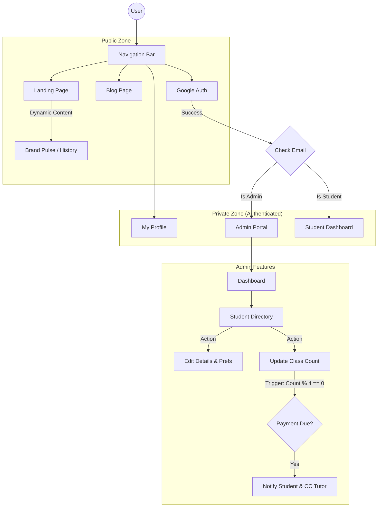

# Student Guitar Tutor - Master Design Flow

## Visual Site Map

## Detailed Flow (Top-to-Bottom)

### 1. Global Navigation (Sticky Top)
*   **Menu Items**: Home, Blog, My Profile, Login/Avatar.
*   **Auth State**:
    *   **Guest**: Shows "Login" button.
    *   **Logged In**: Shows User Avatar -> Dropdown (Profile, Logout).

### 2. Authentication (Google Auth)
*   **User Action**: Clicks "Login with Google".
*   **System Check**:
    1.  Authenticates user.
    2.  Checks Email against **Admin List** (Backend).
*   **Routing**:
    *   **If Admin**: Redirect to `/admin`.
    *   **If New/Regular**: Create/Load "Student" profile -> Redirect to `/profile` or Home.

### 3. Landing Page (`/`)
*   **Hero Section**: Hook the user ("Master Guitar").
    *   *Action*: "Join Now" triggers Login flow.
*   **Guitar History**: Immersive scrolling section with visuals.
*   **Legends Hall of Fame**: Carousel of icons (Hendrix, etc.).
*   **Brand Pulse**:
    *   Live-updating news cards for **Yamaha, Fender, Gibson**.
    *   *Source*: Curated real-time emulation.

### 4. Additional Pages
*   **Blog** (`/blog`): Grid of value-add articles ("5 Tips for Speed").
*   **My Profile** (`/profile`): 
    *   User details (Name, Contact).
    *   *Read-Only*: Class Count (Managed by Admin).

### 5. Admin Portal (`/admin`)
*   **Access**: Protected Route. Only accessible if `role === 'admin'`.
*   **Student Directory**:
    *   **Master List**: View all registered students.
    *   **Student Logic**:
        *   **Preferences**: Toggle [x] Email, [x] WhatsApp per student.
        *   **Progression**: Manually update `Class Count` after lessons.
    *   **Payment Automation**:
        *   **Scenario**: Tutor updates `Class Count` from 3 -> 4.
        *   **System Action**: Prompts "Send Fee Reminder?".
        *   **Outcome**:
            1.  **Student Receives**: "Hi [Name], 4 classes done. Fees due." (via Email/WA).
            2.  **Tutor Receives**: EXACT COPY of the message (via Email AND WA) for records.

## Technical Feasibility (Web App)
*   **Audio Analysis**: Use Web Audio API for pitch detection (tuner/lesson feedback).
*   **Visuals**: Canvas or SVG for scrolling tabs/notation.
